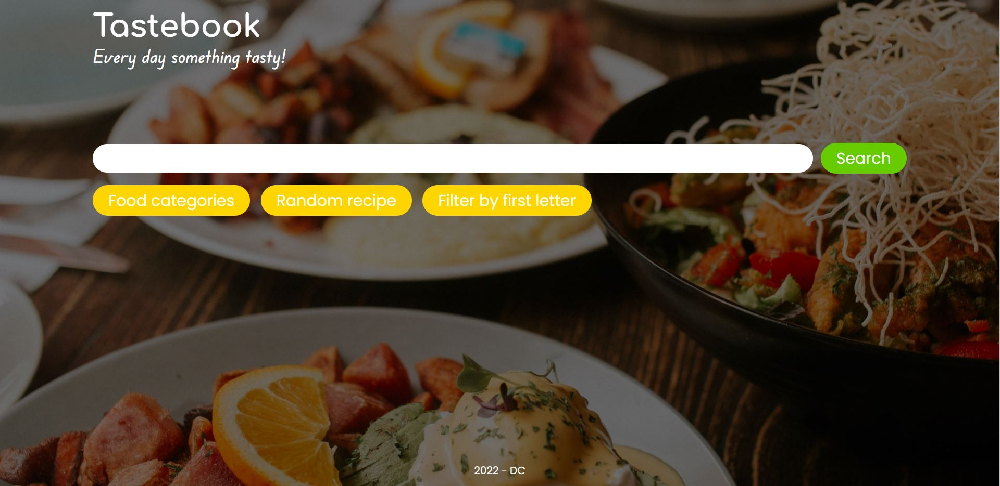
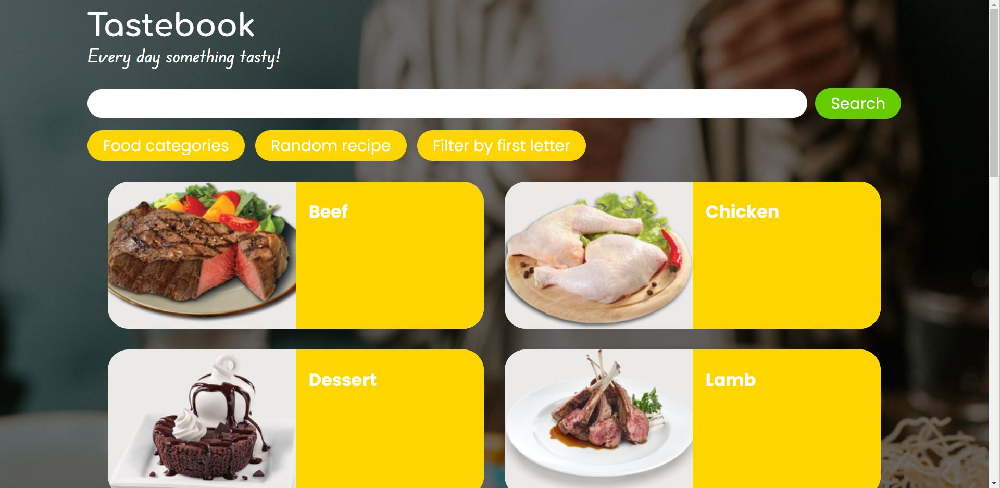
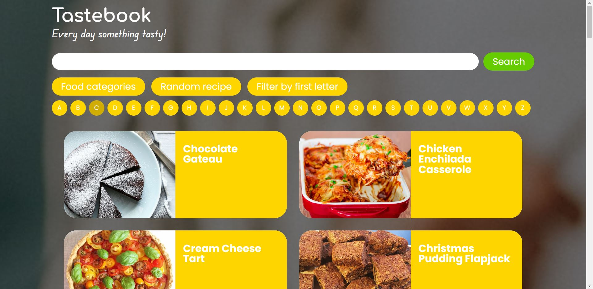
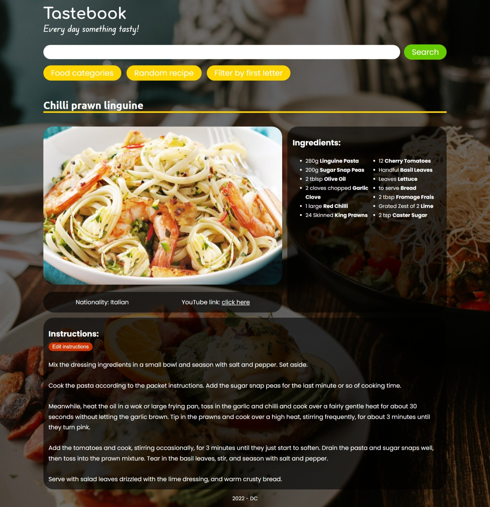
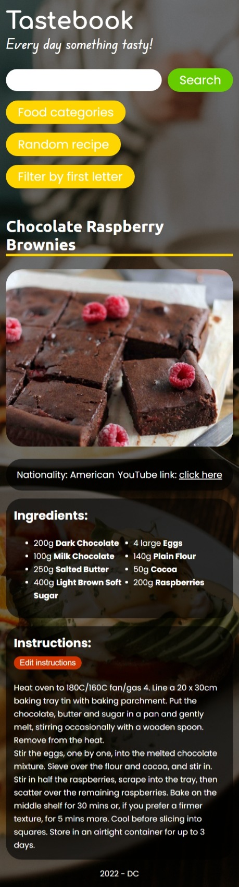

# tastebook
 find recipes for different food categories

 the app fetches an API with recipes. the user can search for specific meals or can browse them by category, first letter or can select a random recipe.

 while on a recipe page, the user can edit the instructions and save them locally. if the user wants to acces the same recipe later on, he has the option to switch between the original list of instructions or the edited one.

 *API available at https://www.themealdb.com/
 

 img1 shows the homepage when the site first loads

 

 img2 and img3 show the page while browsing by category and by first letter

 
 

img4 represents the individual food recipe layout

 

img5 shows the mobile layout of the individual food recipe

 
